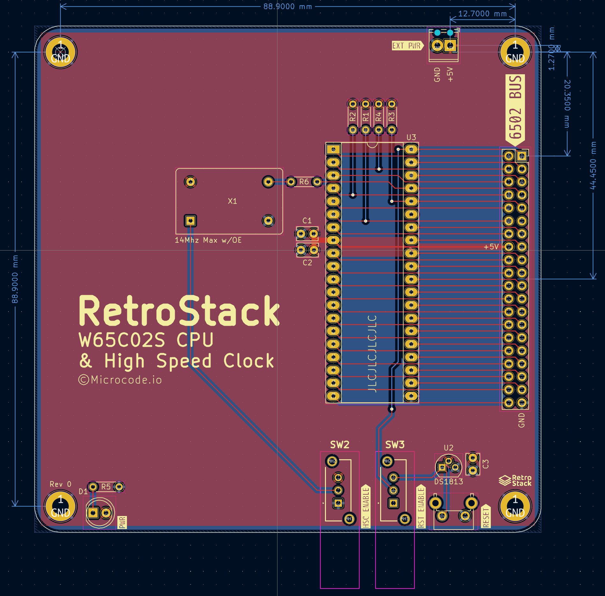
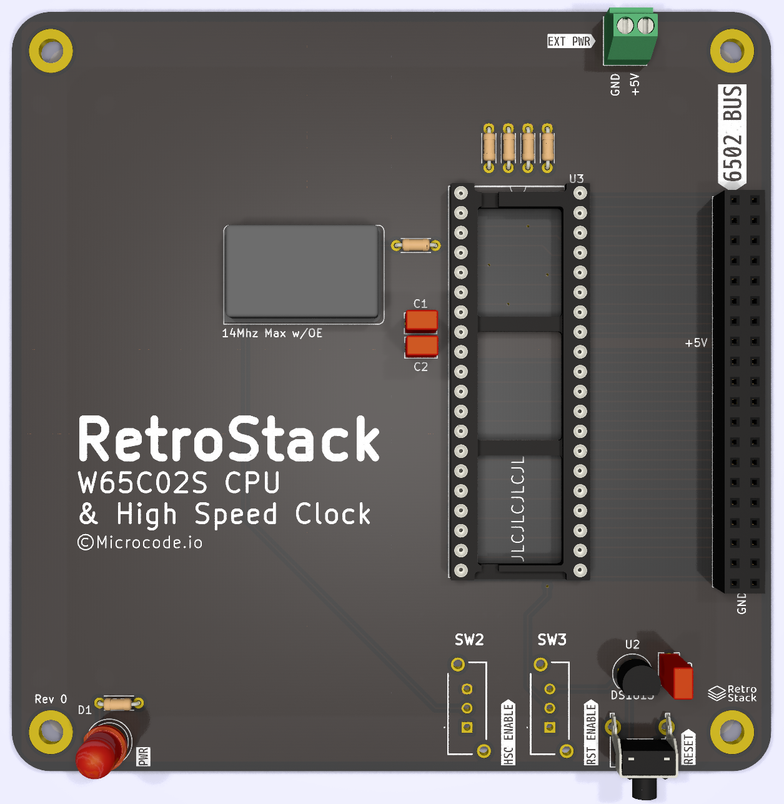

# RetroStack - W65C02S CPU & High Speed Clock Module

This module contains the W65C02S CPU, a selectable high speed oscillator, and a selectable DS1813 reset signal manager.

## Schematic

Current schematic [pdf](./assets/schematic.pdf).

## PCB Layout & Render

## Known Issues

N/A
