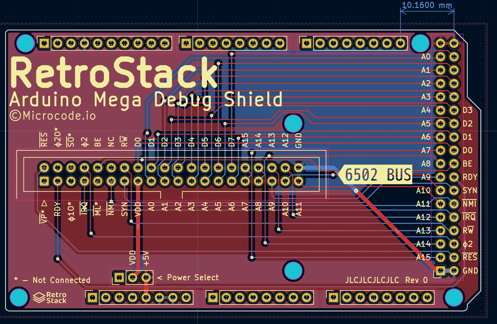
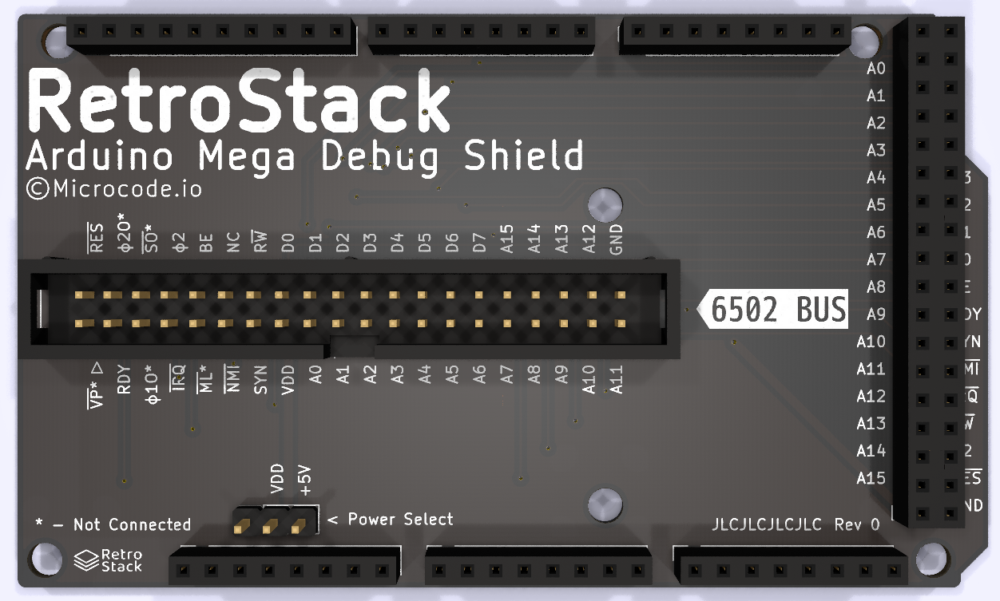

# RetroStack - Arduino Mega Debug Shield

This Arduino Mega shield is designed to easily connect to the RetroStack Debug board via a 40 pin IDC connector.

## Schematic

Current schematic [pdf](./assets/schematic.pdf).

## PCB Layout & Render

## Known Issues

- 6502 Bus is backwards. Pin 1 should be RESB but is VPB instead.
- PHI2 should be connected to one of the digital pins that support interrupts (2, 3, etc)
  - Consider adding jumpers to send a few signals to interrupt pins.
- Power seems to be leaking between the arduino and the RetroStack. Needs diodes?
