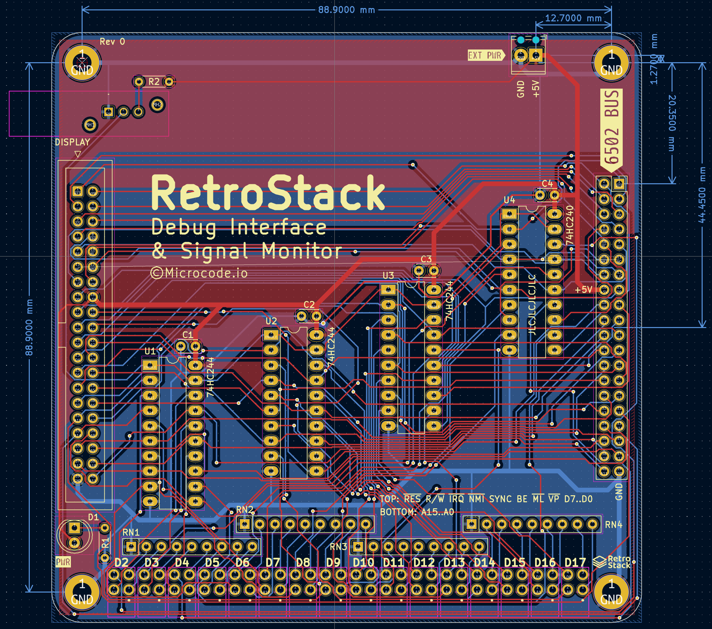
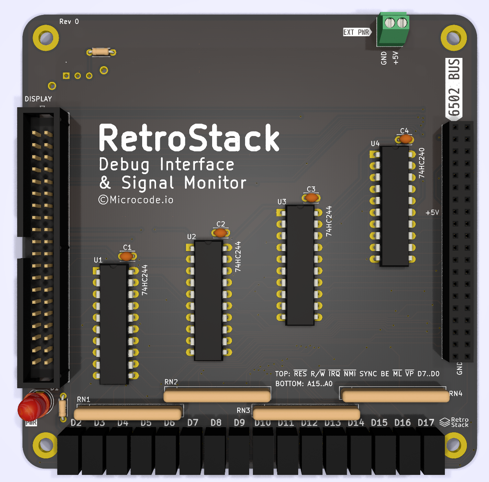

# RetroStack - Debug Interface & Signal Monitor Module

This module provides a 40 pin IDC connection for use with an external debugging tool/circuit. In addition, all of the Address and Data signals and most of the control signals are routed through buffers to drive LEDs. The buffers can be disabled by the Display switch in the upper left when operating at higher speeds.

## Schematic

Current schematic [pdf](./assets/schematic.pdf).

## PCB Layout & Render

## Known Issues

N/A
