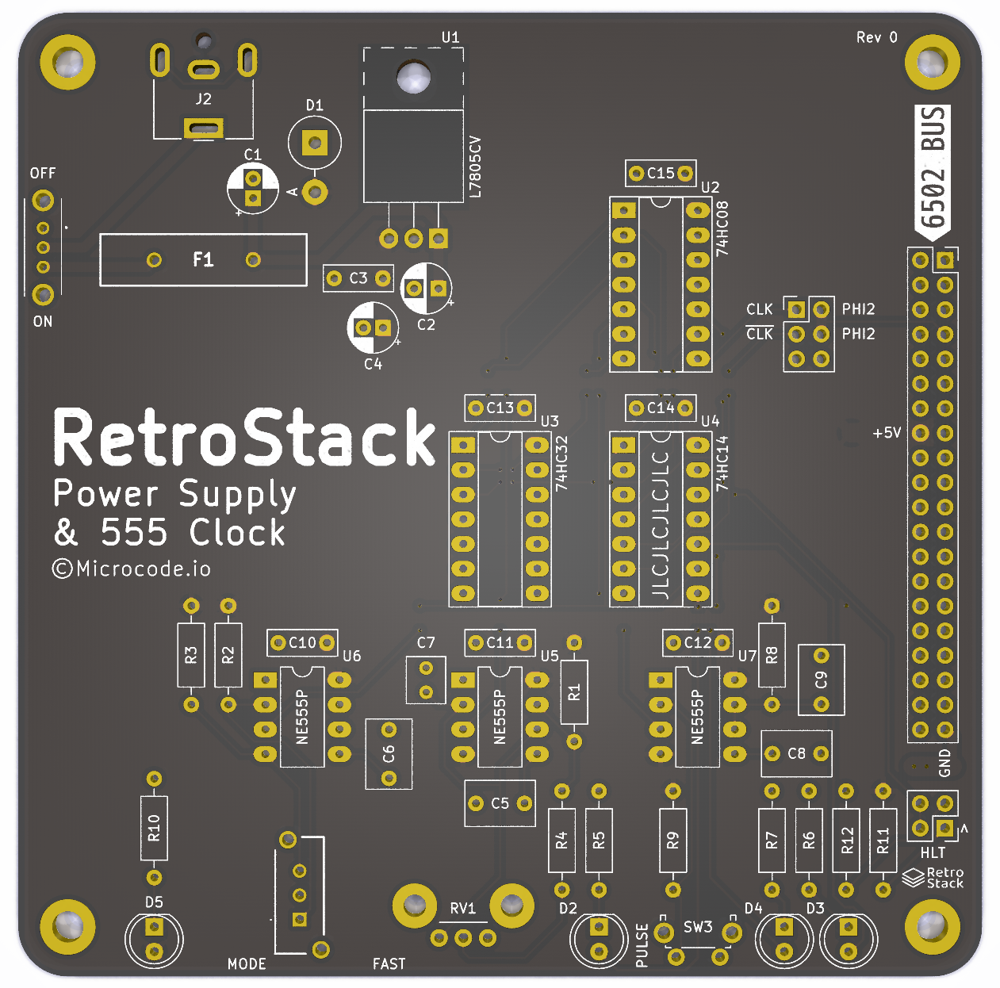

# RetroStack - Power & Clock Module

This module is based on the 555 clock circuit used in Ben Eater's 8-bit and 6502 computer projects.

## Schematic

Current schematic [pdf](./assets/schematic.pdf).

## PCB Layout & Render

## Known Issues

- PTC is oversized.
- TVS diode is oversized.
- Need knob for RV1.
- Need 2.54mm pitch header jumpers.
- Add more detail to silkscreen.
- Remove Net ties.